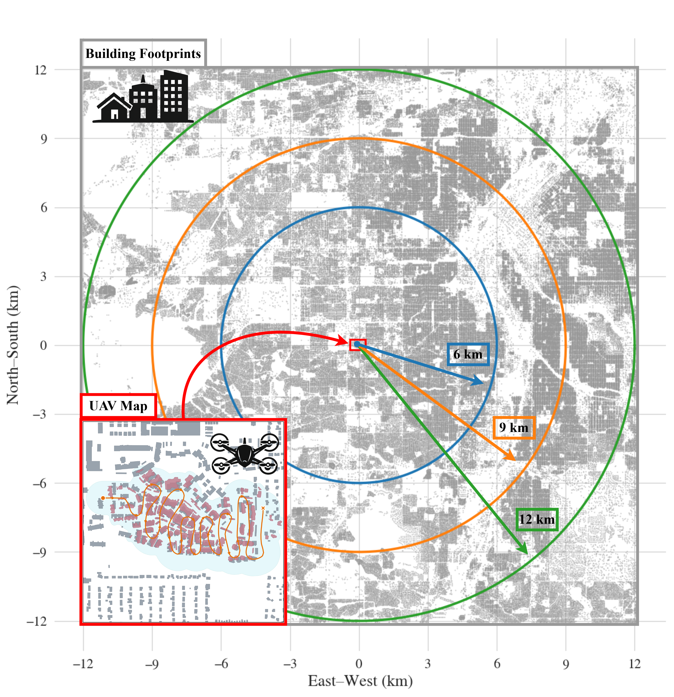
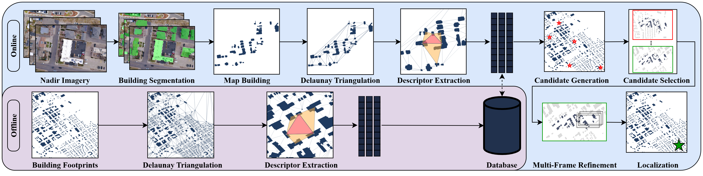

# Large-Scale Geometric Map-Based Localization of UAVs in GNSS-Denied Urban Environments

**Garth J.S. Terlizzi III and Kaveh Fathian**

ARIA Lab · Department of Computer Science · Colorado School of Mines

[Paper (arXiv)](https://arxiv.org/abs/2609.28225) · [Project page](https://ariarobotics.github.io/aerial_urban_localization/) · [Research video](https://ariarobotics.github.io/aerial_urban_localization/#video)



## Overview

How can a UAV determine its position when GNSS is unavailable? This work localizes UAVs by matching buildings observed by a downward-facing camera to a reference building footprint map. It uses the spatial arrangement and shape of buildings to distinguish locations across metropolitan-scale search areas.

The system accumulates building observations across video frames, constructs a local map, and matches geometric descriptors against a reference database. Candidate locations are ranked and refined as more observations become available.

## Method



1. **Observe and accumulate.** Segment buildings in aerial keyframes and stitch the detections into a local building map.
2. **Describe the geometry.** Extract star descriptors from a Delaunay triangulation, combining local triangle structure with building compactness, elongation, rectangularity, and convexity.
3. **Match and refine.** Match against reference descriptors computed offline, rank candidate locations using consensus voting and geometric scoring, and refine the position across frames.

## Results

The method was evaluated on **seven real UAV flights across four municipalities**, using reference maps containing up to approximately **277,000 buildings**.

| Reference map area | Recall@1 | Correctly localized flights |
| --- | --- | --- |
| ≈113 km² | 100% | 7 / 7 |
| ≈254 km² | 100% | 7 / 7 |
| ≈452 km² | 71.4% | 5 / 7 |

Recall@1 counts flights whose top-ranked position estimate is within **100 m of ground truth**. The evaluated BRM and NetVLAD baselines achieved 0% Recall@1 at ≈254 km² and ≈452 km².

## Available materials

This repository contains the project website, [research video](assets/iros_video_final_white_background.mp4), and figures illustrating the [pipeline](assets/pipeline.png) and [candidate comparison](assets/localization-comparison.png).

The research implementation, evaluation datasets, and manuscript PDF are not included in this repository. The [paper is available on arXiv](https://arxiv.org/abs/2609.28225).

## Code access

In light of ongoing global events and the potential for misuse of UAV technologies, we are not publicly releasing the research code. To request access, please [email the authors](mailto:garth_terlizzi@mines.edu) with your institutional or organizational affiliation and a brief description of your intended use. Requests will be considered on a case-by-case basis.

## Citation

```bibtex
@misc{terlizzi2026geometric,
  title = {Large-Scale Geometric Map-Based Localization
           of UAVs in GNSS-Denied Urban Environments},
  author = {Terlizzi, III, Garth J. S. and Fathian, Kaveh},
  year = {2026},
  eprint = {2609.28225},
  archivePrefix = {arXiv},
  url = {https://arxiv.org/abs/2609.28225}
}
```

## License and contact

All rights reserved. See [LICENSE](LICENSE) for terms. For questions or permission requests, contact [Garth Terlizzi](mailto:garth_terlizzi@mines.edu).
